# LDTS_1301 - Boxes Wizard

Inspired by Boxes Wizard, our game centers around obtaining a trophy, revealed only after conquering every diamond. There's also an interesting feature, a feature that allows the player to teleport between boxes!!   
The game features three difficulty levels, each presenting its own unique map. Players must navigate through all levels to successfully complete the game, encountering different challenges along the way.

>This project was developed for **LDTS 2023/2024** by:   
`Martim Moniz` - up202206958   
`Sofia Cruz` - up202208135  
`Tatiana Lin` - up202206371  
      
## IMPLEMENTED FEATURES

**Switching Between Wizard and Boxes**- This feature enhances player interaction by introducing dynamic transformations between the main character and designated boxes. Specifically, when the player clicks on `1` the game transitions between the main character and box_1. Similarly, clicking on `2` initiates transformations between the main character and box_2.     
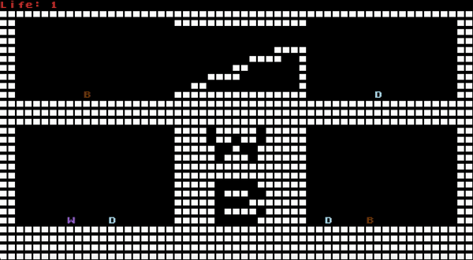

**Epic Jumping Skills**- Our wizard isn't an average jumper, he's got this unique ability to keep jumping like there's no tomorrow.   
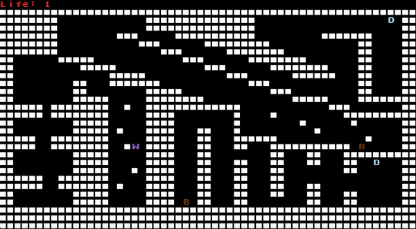

**Spike traps**- Watch your step! Our game features spike traps that spell trouble for the main character. One wrong move, and boom - the wizard is dead.    
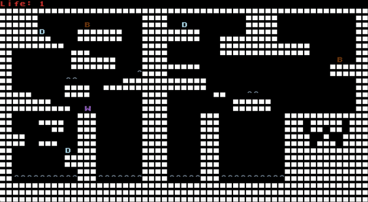 

**Trophy**- Trophy appears after all the diamonds are catched. It's like a reward for mastering the game and proving you've got what it takes to snag every last diamond.     
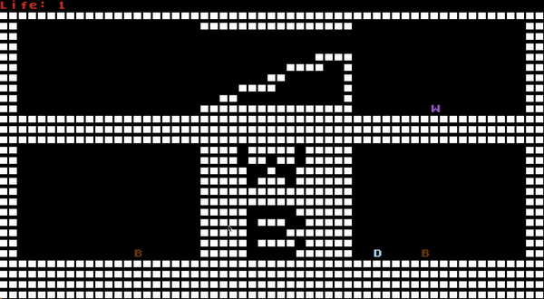  

**Gravity**- There's the presence of gravity just like in the real world.
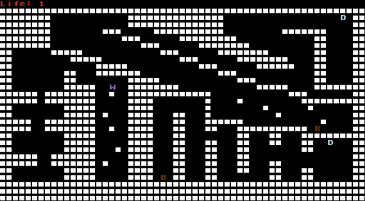

## SCREENSHOTS

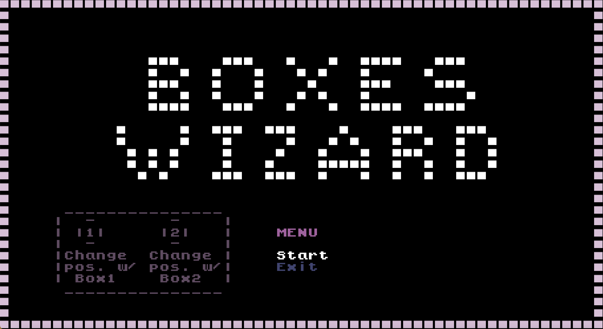

**Level 1**  
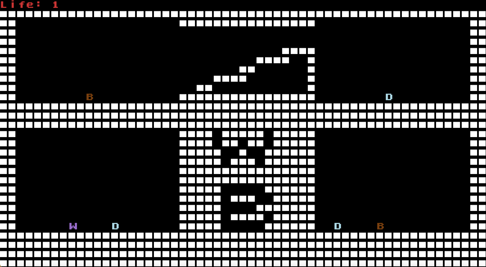

**Level 2**  
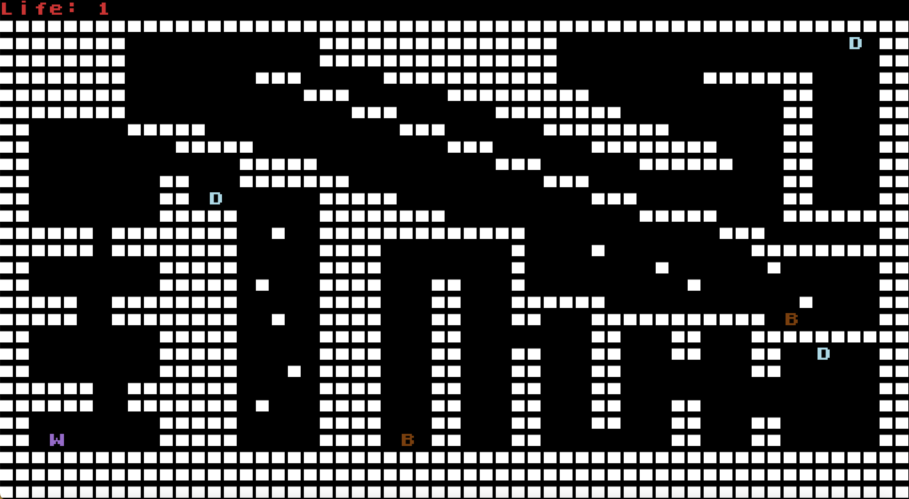

**Level 3**  
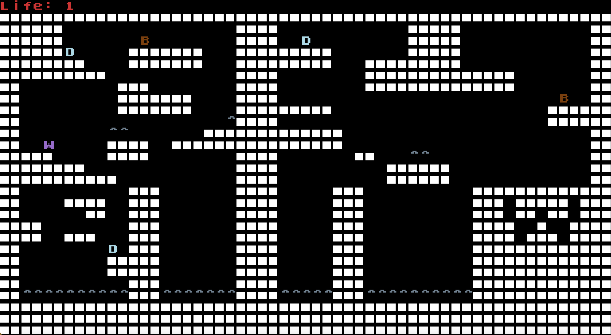

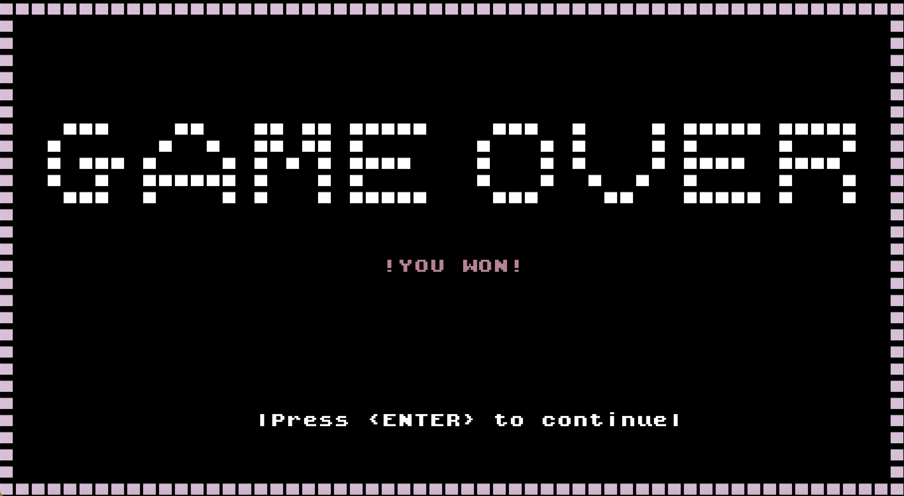

## UML

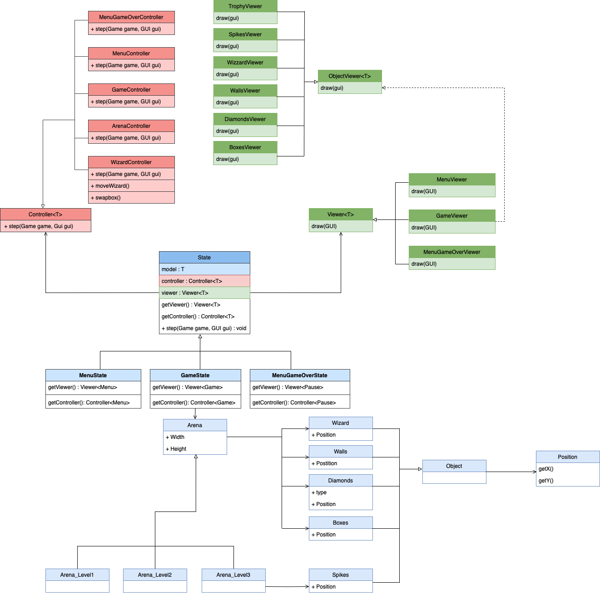

## DESIGN
In addressing the design challenges encountered throughout our project, we incorporated the following design patterns: the State pattern, the Factory Method pattern, the Singleton pattern and the Model-View-Controller (MVC) pattern.

## More Information
For a more detailed version please check this [Detailed Report](docs/README.md).