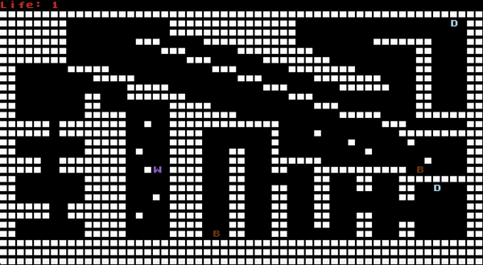
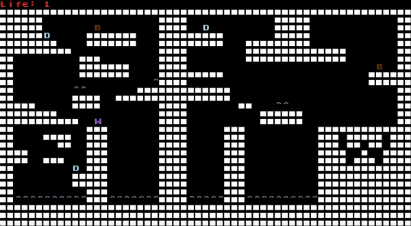
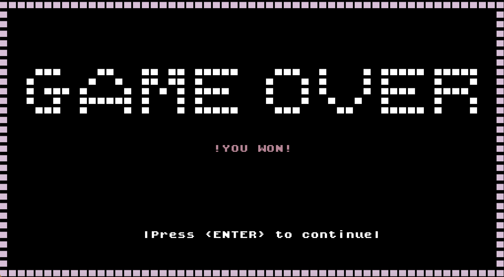

# LDTS_1301 - Boxes Wizard

Inspired by Boxes Wizard, our game centers around obtaining a trophy, revealed only after conquering every diamond. There's also an interesting feature, a feature that allows the player to teleport between boxes!!   
The game features three difficulty levels, each presenting its own unique map. Players must navigate through all levels to successfully complete the game, encountering different challenges along the way.

>This project was developed for **LDTS 2023/2024** by:   
`Martim Moniz` - up202206958   
`Sofia Cruz` - up202208135  
`Tatiana Lin` - up202206371

## IMPLEMENTED FEATURES

**Switching Between Main Character and Boxes**- This feature enhances player interaction by introducing dynamic transformations between the main character and designated boxes. Specifically, when the player clicks on `1` the game transitions between the main character and box_1. Similarly, clicking on `2` initiates transformations between the main character and box_2.     

**Epic Jumping Skills**- Our wizard isn't an average jumper, he's got this unique ability to keep jumping like there's no tomorrow.   

**Spike traps**- Watch your step! Our game features spike traps that spell trouble for the main character. One wrong move, and boom - the wizard is dead.    

**Trophy**- Trophy appears after all the diamonds are catched. It's like a reward for mastering the game and proving you've got what it takes to snag every last diamond.     

**Gravity**- There's the presence of gravity just like in the real world.

### Controls
`^` : make wizard jump.   
`<` : move wizard to the left.   
`>` : move wizard to the right.   
`v` : move wizard downwards.   
`1` : switch between wizard and box_1.   
`2` : switch between wizard and box_2.   
`Q` : (in the **Game Levels**) press `Q` to go back to the MainMenu.   
`ENTER` : (in the **GameOver Menu**) press `ENTER` to go back to the MainMenu.      

## SCREENSHOTS

**Main Menu**  

**Level 1**  

**Level 2**  

**Level 3**  

**GameOver Menu**  

## UML

## DESIGN

>### MVC- Model, View, Controller

#### Problem in Context
As the complexity of the game grows, the program tends to become increasingly intricate, making it challenging to comprehend and maintain. It can also result in multiple issues such as code entanglement, limited code reuse, and difficulties in testing the program.

#### The Pattern
MVC is an architectural pattern commonly used for developing user interfaces that divides an application in three parts:
>**Model**: only represents the **data**.  
>**View**: displays the **model** data, and sends user actions to the **controller**.  
>**Controller**: provides **model** data to the **view**, and interprets user actions.   
So in short, the model is responsible for the data, the view for the visual interface and the controller for the logic of the game.

#### Implementation

#### Packages
- [Model](https://github.com/FEUP-LDTS-2023/project-l13gr01/blob/789ab88477262fe34f079c2d7803737b0cdb74c0/src/main/java/org/l13gr01/boxesWizard/model)
- [Viewer](https://github.com/FEUP-LDTS-2023/project-l13gr01/blob/789ab88477262fe34f079c2d7803737b0cdb74c0/src/main/java/org/l13gr01/boxesWizard/viewer)
- [Controller](https://github.com/FEUP-LDTS-2023/project-l13gr01/blob/12b7ed38a7e0b3f62ed60a508161a68977e50e2f/src/main/java/org/l13gr01/boxesWizard/controller)

#### Consequences
This way of organizing makes the code easier to manage and test. Also it allows for better code reuse, for example, you can have different views for the same model or reuse a controller with different models.
>### Game State

#### Problem in Context
The game has multiple states: the main menu, the game itself, the try again screen and the pause screen. It behaves differently depending on which state it's at, so the program should be able to change efficiently and easily between states. For example, when the main character dies, the game state should be set to the try again screen.

#### The Pattern
The State pattern allows an object to alter its behavior when its internal state changes. For example, the main controller and viewer is defined depending on the current state and each state has its own controller and viewer.
As a result, we are able to smoothly swich from one state of the game to another.

#### Implementation

#### Consequences
With this pattern we avoid using conditionals. Also localize behavior for different states and make state transitions explicit.

>### Main character

#### Problem in Context
There’s should be only one maincharacter.

#### The Pattern
Singleton (creational design pattern) ensures that a class only has one instance, while providing a global point to access to this instance.
#### Implementation

#### Consequences
This pattern makes sure that class Main_character has only a single instance.

#### Consequences
It makes the job of creating new copys of already exisiting objects much efficient.

>### Arenas

#### Problem in Context
The game has different types of Arenas, for each level, so we would need to build them each time.

#### The Pattern
The Factory pattern (creational design pattern) provides an interface for creating an object in a superclass, but lets the subclasses decide which class to instantiate.

#### Implementation

#### Consequences
This pattern can reduce code duplication, because the creation logic for different types of Arenas is similar, but varies in specific details, such as their funtionalities. In this way, each concrete creator class can encapsulate the common logic and provide the necessary variations.   
Also, it provides a consistent interface ('ArenaBuilder'), regardless of the concrete class.

### TESTING
#### Test Coverage

#### Mutation Testing

---------------- 
### SELF-EVALUATION
- **Martim Moniz** - 40%
- **Sofia Cruz** - 20%
- **Tatiana Lin** - 40%
  
